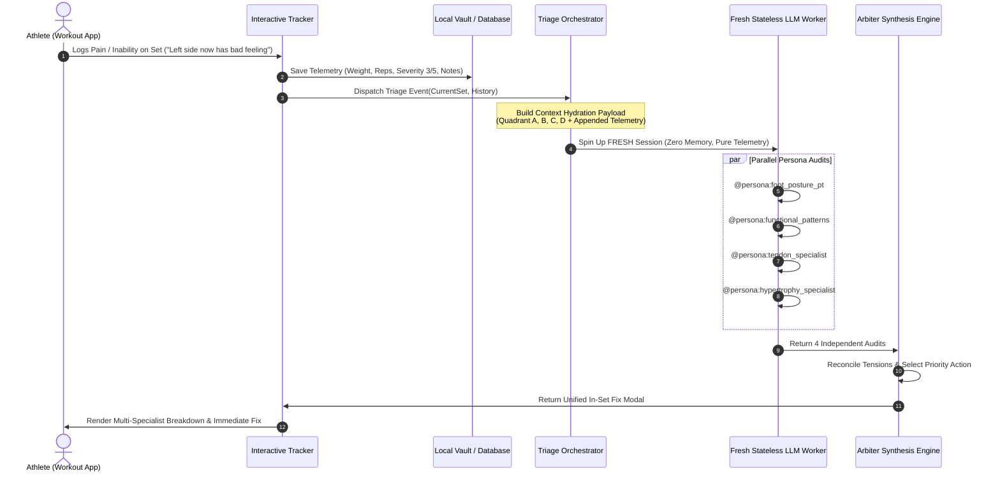

# PRODUCT REQUIREMENTS DOCUMENT (PRD)
# PhysioSync AI: Biomechanical Workout Matrix & Clinical Exercise Engine
**Document Version:** 2.0.0-PROD  
**Author:** Head Coach Arbiter & System Architecture Team  
**Date:** October 3, 2026  
**Status:** Approved for Engineering Implementation  

---

## 1. Executive Summary & Product Vision

### 1.1 The Vision
**PhysioSync AI** is an intelligent, biomechanically governed athletic training and rehabilitation platform. Unlike traditional fitness applications that deliver static spreadsheets or generic LLM chatbots that output cookie-cutter gym advice, PhysioSync AI couples a **living biomechanical blueprint** with an **interactive neuromuscular tracking interface** and an **isolated multi-specialist clinical reasoning engine**.

The system dynamically adapts programming, detects acute joint compensations before tissue failure, preserves hypertrophy stimuli under structural constraints, and permanently resolves root-cause postural asymmetries.

### 1.2 Core Architectural Principles
1. **The "Innocent Victim" Rule:** Extremity joints (wrists, elbows, knees, ankles) are almost never primary root causes of pain; they are compensations forced upon them by the master postural hubs (pelvis, ribcage, scapulothoracic rhythm, and foot tripod).
2. **Strict Persona Isolation:** Clinical domain evaluations (Foot/Posture PT, Functional Patterns, Tendon Preservation, Hypertrophy) must NEVER be generated in a single monolithic prompt. Each persona executes in its own isolated LLM container to prevent cross-contamination, dilution, or premature compromise.
3. **Stateless Ephemeral Re-Evaluation (Anti-Anchoring / Anti-Sycophancy):** When an athlete reports subsequent exercise feedback or unexpected symptoms (e.g., *"right side was better, but now left side has the bad feeling"*), the system **must NOT continue in the same chat thread**. It spins up a **FRESH LLM session** loaded with the fully hydrated historical snapshot + appended telemetry, forcing zero-bias, objective re-evaluation and preventing false confirmation of past diagnoses.
4. **Deterministic Arbiter Synthesis:** A dedicated Lead Coach Arbiter evaluates the independent specialist outputs against real-world fatigue budgets, eliminating contradictions and delivering an unambiguous in-set execution directive.

---

## 2. Target Athlete Profile & Structural Baselines

| Dimension | Baseline Parameter | Clinical Implications |
| :--- | :--- | :--- |
| **Occupational Posture** | 10+ Hours/Day Desk Sitting with Rightward Lean | Chronic shortening of Psoas Major (T12–L5 anchor) and Right QL; right 12th rib depression; right pelvic hike; anterior pelvic tilt (APT). |
| **Foot & Ankle** | Left Ankle Talus Block (4-inch knee-to-wall deficit); Infant Pronation History | Left ankle cannot glide into posterior dorsiflexion; forces diagonal compensatory load into Right Rearfoot (calcaneus eversion). |
| **Connective Tissue** | Medial Epicondyle Sensitivity (+15kg pull-up history); Past Achilles Strain | 8–12 week collagen lag behind muscle strength; requires lifting straps >20kg, 70% MVC isometrics, and zero flat-foot landings. |
| **Equipment Matrix** | 5–40 kg Adjustable Dumbbells, Pull-Up Bar, Bed/Floor, Heavy Resistance Bands | Zero commercial gym machines or benches; requires bolster deficits, wedge elevation, and band anchoring. |
| **Session Budget** | 46–48 Minute Hard Cap | Staggered antagonistic supersets; maximum 4 direct movements per workout. |

---

## 3. Implemented Capabilities (Current State)

### 3.1 The 7-Day Clean-Slate Periodization Plan
* **Day 1: Athletic Power & Anterior Quads/Pecs:** Double-Leg Broad Jumps (2s stick), 15°–20° Heel-Elevated Goblet Squats (24–40kg), Single-Arm Thoracic Deficit DB Press on Bolster (16–22kg), Spanish Squats.
* **Day 2: Vertical Pull, Posterior Chain & Calves:** Barefoot 90/90 Hamstring Bridge with Left Hip Shift, Bed-Braced Single-Arm DB Row with Straps (32–40kg), B-Stance Kickstand DB RDL (24–34kg), 2-Second Pause Straight-Leg Calf Raise.
* **Day 3: Mid-Week Autonomic Regeneration:** 45-Minute Outdoor PRI Decompression Walk, Bed Couch Stretch (psoas release), Side-Lying Thoracic Windmills.
* **Day 4: Vertical Pull, Shoulders & Long-Head Triceps:** Keith Baar Isometric Wrist Flexion/Extension (70% MVC), Bodyweight Strict Neutral Pull-Ups (tendon lag focus), Seated Neutral DB Overhead Press with 30°–45° Scapular Plane & Ear-Level Clamp, Overhead Triceps Extension with 90° Clamp, Lateral Raises, Prone Bed Neck Extensions.
* **Day 5: Unilateral Ankle Restoration & Glute Drive:** Lateral Skater Bounds (2s stick), Elevated Front-Foot ATG Split Squat (hamstring-to-calf cover for left talus mobilization), Bed-Edge B-Stance Hip Thrust (27–34kg), Contralateral Left-Hand Offset Suitcase Carry (26–32kg), Prone Banded Hamstring Curls.
* **Day 6: Deceleration Power, Pectoral Deficit & Arms:** Double-Leg Broad Jump, Standing Band Pallof Press with Shuffle Steps, Bed-Deficit Push-Ups (feet on bed, hollow-body lock), Standing Incline-Torso DB Bicep Curls (12–18kg), **Decoupled Forearm Armor (Palms-Up Flexion 10–18kg vs. Palms-Down Extension 5–10kg)**, Spanish Squats, 4-Way Neck Isometrics.
* **Day 7: Full Regeneration & Sunday Latency Audit:** Zero CNS load, 24-hour joint latency check.

### 3.2 The Interactive Web Application (`interactive_muscle_feedback.html`)
* **3D-Style SVG Mannequin:** Dual-view (Anterior / Posterior) dynamic human figure with 40+ individually clickable and hoverable muscle nodes.
* **Real-Time Node Illumination:** Active target muscles glow in cyan (`#00f2fe`); pre-existing tension renders purple; fatigue renders yellow; acute pain renders bright pulsing red.
* **Pre-Flight Readiness Gate:** Mandatory pre-check tab before Set 1 to palpate joints and log baseline stiffness.
* **Set-Level Granular Metrics:** Logs Weight (kg), Reps, Sensation Status (Clean, Pain, Fatigue, Pre-check), Severity (1–5 slider), and qualitative athlete notes.
* **Coach-Vetted Video Form Player:** Embedded YouTube form demonstrations featuring top coaches (Squat University, Blue Collar Fitness, Muscle & Strength, Clean Health, DeltaBolic) with custom modal playback and direct fallback links.
* **Persistence Engine:** Versioned `localStorage` vault (`physiosync_vault_v6_forearms_decoupled_20261001`) with legacy migration to ensure zero data loss.

---

## 4. Multi-Agent Persona Architecture (Isolated LLM Execution)

### 4.1 The Technical Problem
When a single LLM prompt is asked to act as multiple specialists simultaneously (e.g. *"Act as a PT, a biomechanist, and a bodybuilder"*), the model suffers from **attention blending** and **premature compromise**. The hypertrophy specialist concedes volume too early, the PT ignores mechanical tension, and the output regresses to generic, homogenized advice.

### 4.2 The Solution: 4 Isolated Persona Invocations
When an athlete logs a symptom, inability, or failure event, the backend orchestrator triggers **four parallel, completely isolated LLM calls**. Each persona operates with its own system prompt, knowledge boundaries, and evaluation criteria:

```
                                [Athlete Sensation / Pain Log]
                                               │
               ┌───────────────────────────────┼───────────────────────────────┐
               ▼                               ▼                               ▼                               ▼
      ┌─────────────────┐             ┌─────────────────┐             ┌─────────────────┐             ┌─────────────────┐
      │  CALL 1 (PT)    │             │  CALL 2 (FP)    │             │ CALL 3 (TENDON) │             │ CALL 4 (HYPER)  │
      │ Foot, Ankle &   │             │ Functional      │             │ Joint & Tissue  │             │ Hypertrophy &   │
      │ Posture PT      │             │ Patterns        │             │ Preservation    │             │ Overload Arbiter│
      └────────┬────────┘             └────────┬────────┘             └────────┬────────┘             └────────┬────────┘
               │                               │                               │                               │
               └───────────────────────────────┼───────────────────────────────┘
                                               ▼
                               ┌───────────────────────────────┐
                               │       CALL 5 (SYNTHESIS)      │
                               │      Lead Coach Arbiter       │
                               │  (Conflict Resolution Matrix) │
                               └───────────────┬───────────────┘
                                               ▼
                                 [Unified In-Set Action Plan]
```

### 4.3 Persona Definitions & Diagnostic Contracts

#### Persona 1: Foot, Ankle & Posture Physical Therapist (`@persona:foot_posture_pt`)
* **Primary Lens:** Ground-up ascending closed-kinetic chain; foot tripod arthrokinematics; talus mortise gliding; sensory mechanoreception.
* **Diagnostic Checklist:**
  1. Did the foot arch collapse into un-decelerated pronation?
  2. Was the left talus posterior glide block engaged?
  3. Did the athlete lose tripod contact (1st MTP, 5th MTP, calcaneus)?
  4. Did stance asymmetry drive an ascending pelvic hike or lumbar torsion?
* **Permitted Interventions:** Band-distracted joint glides, Janda short-foot doming, heel-wedge adjustments, barefoot stance corrections, soleus eccentric drops.

#### Persona 2: Functional Patterns (FP) Biomechanical Specialist (`@persona:functional_patterns`)
* **Primary Lens:** Multi-planar fascial tension integrity; reciprocal contralateral gait cycle; spiral lines; axial decompression.
* **Diagnostic Checklist:**
  1. Is the Posterior Oblique Sling (Right Lat $\leftrightarrow$ Left Glute Max) dormant, forcing the Right QL to act as a surrogate stabilizer?
  2. Is the Anterior Oblique Sling (Right External Oblique $\leftrightarrow$ Left Internal Oblique/Adductor) disconnected?
  3. Did the exercise trap the athlete in an un-decompressed linear sagittal groove?
  4. Is the symptom a manifestation of the thoracic-pelvic counter-rotation restriction?
* **Permitted Interventions:** Contralateral sling reaches, transverse anti-rotation holds, standing axial decompression breathing, unilateral offset carries, elimination of passive static stretches.

#### Persona 3: Tendon & Joint Preservation Specialist (`@persona:tendon_specialist`)
* **Primary Lens:** Keith Baar molecular collagen synthesis; Stuart McGill lumbar spine biomechanics; mechanical load dissipation; tendon lag dynamics.
* **Diagnostic Checklist:**
  1. Did the movement enter a joint "collapse zone" (bottom 10% ROM where stabilizers disconnect)?
  2. Is the tissue exhibiting acute 24-hour delayed ache latency?
  3. Was the tempo fast and ballistic, bypassing viscous tendon damping?
  4. Is external shear exceeding the 8–12 week collagen remodeling rate?
* **Permitted Interventions:** Mandatory 70% MVC isometrics (30–45s holds), strict depth clamping (e.g. ear-level press, 90° triceps elbow), 3–4s eccentric tempo enforce, lifting straps.

#### Persona 4: Hypertrophy & Progressive Overload Specialist (`@persona:hypertrophy_specialist`)
* **Primary Lens:** Chris Beardsley / Mike Israetel mechanical tension; motor unit recruitment; proximity to failure (0–2 RIR); stretch-mediated hypertrophy.
* **Diagnostic Checklist:**
  1. Will the proposed medical modification completely destroy the target muscle's mechanical tension?
  2. Can we substitute a biologically equivalent deficit/unilateral exercise that preserves the target stimulus without aggravating the joint?
  3. What is the precise RIR and load adjustment required to maintain progressive overload?
* **Permitted Interventions:** Load recalibration, deficit bolster modifications, dumbbell angle shifts (45° arrowhead), drop-set/rep band scaling.

---

## 5. Fresh-Session Telemetry Hydration Architecture (Anti-Anchoring / Anti-Sycophancy Engine)

### 5.1 The Critical Flaw of Continuous Chat Threads
When an athlete interacts with an AI coaching agent in a single, continuous conversation thread over days or weeks:
1. **Confirmation Bias / Sunk Cost Fallacy:** If the AI previously diagnosed *"Right QL spasm"* and recommended a specific bridge, and the athlete returns saying *"Now my left side has the bad feeling"*, the continuous LLM is biased by its own prior outputs. It will attempt to defend its original premise, harmonize the contradiction, or force a rationalization.
2. **False Acceptance (Sycophancy):** The LLM often blindly validates user self-diagnoses rather than impartially analyzing the raw biomechanical telemetry.
3. **Context Drift & Degraded Attention:** As conversation tokens grow, the LLM loses high-precision focus on baseline rules (e.g. 10hr desk sitting, 4-inch talus block).

### 5.2 The Stateless Ephemeral Session Solution
Every time an exercise outcome, set feedback, or symptom is submitted:
* **The active conversational thread is NOT used for diagnostic reasoning.**
* The backend bundles the athlete's **Master Historical Ledger** + **The Active Workout State** + **The Brand New Feedback Event** into a clean, structured payload.
* The backend spins up a **FRESH, EPHEMERAL LLM SESSION** (Session 0 Context) with zero conversational memory.
* The fresh LLM evaluates the situation with **100% objectivity**, completely unburdened by prior conversational ego or need for consistency.
* Once the fresh diagnosis is generated, the result is streamed back into the athlete's user-facing interface.



### 5.3 The Context Hydration Schema (Payload Injected into Fresh Session)

```json
{
  "athlete_metadata": {
    "athlete_id": "nipun_mehra",
    "timestamp": "2026-10-03T04:20:00Z",
    "primary_structural_baselines": {
      "occupational_posture": "10+ hrs/day desk sitting with rightward lean",
      "pelvic_state": "Anterior pelvic tilt + Right pelvic hike/upslip + Right QL hypertonicity",
      "foot_ankle_complex": "Left talus posterior glide block (4-inch deficit) + Infant right pronation history",
      "tendon_ledger": "Medial epicondyle history at >15kg pull-ups; Achilles strain history; zero flat-foot jumping permitted"
    },
    "proven_breakthrough_cues": [
      "Corkscrew feet outward on goblet squats (equalizes 50/50 hip load)",
      "45° arrowhead tuck on deficit presses (frees clavicle/AC joint)",
      "Ear-level depth clamp on overhead press (eliminates elbow click)",
      "Deep apical chest inhale (physically elevates right ribcage off right hip)",
      "Standing band Pallof press (reciprocally relaxes right QL spasm)"
    ]
  },
  "current_workout_telemetry": {
    "week": 1,
    "day": "day6",
    "exercise_id": "broad_jump_stick",
    "target": "3 sets × 3 reps (130 cm with 2s stick)",
    "active_set": 1,
    "completed_weight": 0,
    "completed_reps": 1,
    "status": "pain",
    "severity": 3,
    "sensation_type": "acute_muscle_guarding",
    "tagged_muscle": "lower_back_right",
    "athlete_raw_feedback": "Did pogo landing flat-footed, then did 90/90 contralateral bridge. Right side felt strong at first, but now left side has the same bad feeling and right is returning. It's tolerable but weird."
  },
  "prompt_directive": "MANDATORY: Evaluate this event as an unanchored, objective clinical panel. Do NOT attempt to defend previous advice. Run independent audits for Foot PT, Functional Patterns, Tendon Specialist, and Hypertrophy Arbiter."
}
```

---

## 6. Comprehensive Edge Case Catalog (All 16 Identified Edge Cases)

The following 16 edge cases—uncovered through live athletic training trials—are codified as functional system requirements:

### EC-01: Local File / CORS Video Player Playback Failure
* **Incident:** YouTube embeds fail to play inside local webview/browser environments (`file://` or restricted CORS headers), leaving the athlete stranded without form cues.
* **PRD Requirement:** All video guide components must feature a **Graceful Dual-Layer Playback Architecture**:
  1. Inline modal player with `origin` sanitation.
  2. Mandatory visible secondary fallback button: `[ ↗ Watch on YouTube in New Tab ]` carrying the direct `v={id}` video URL.

### EC-02: Vetted Multi-Coach Form Tutorial Standards
* **Incident:** Generic YouTube algorithm served an unsafe, biomechanically illiterate neck extension video that encouraged cervical hyperextension and glute jamming.
* **PRD Requirement:** Zero automated or algorithmic video embeds. Every exercise video must be **pre-audited and approved across all specialists** (e.g. Squat University, Clean Health, DeltaBolic, Muscle & Strength).

### EC-03: Angle-Dependent Joint Impingement & The "Arrowhead" Guide
* **Incident:** On Deficit Dumbbell Presses, a 90° T-flare caused the humeral head to jam against the clavicle/AC joint at deep stretch.
* **PRD Requirement:** The UI must display an interactive **"📐 Joint Pinch & Angle Helper"** on all pressing movements:
  * Visual illustration of 90° T-Flare (Impingement Zone) vs. 45°–55° Arrowhead Angle (Subacromial Clearance).
  * 45° Semi-Neutral Wrist Angle cue to ensure external shoulder rotation.

### EC-04: 1-Tap Dynamic Baseline Auto-Scaler (Downstream 24-Week Periodization)
* **Incident:** Athlete tested 25 kg on press (2 reps), then calibrated baseline to 18 kg. Downstream weeks required manual code rewrites.
* **PRD Requirement:** When an athlete logs an initial working weight in Week 1, clicking **"⭐ Calibrate as Active Baseline"** automatically periodizes all 24 weeks across Mesocycles 1–4 in `localStorage` without touching code.

### EC-05: Structured Set Anatomy & 15-Second Finisher Countdown Timer
* **Incident:** On Overhead Triceps Extensions, the prescribed finisher (15s isometric hold at 90° elbow flexion on Set 3) was forgotten because the UI only tracked reps.
* **PRD Requirement:** The logger must support compound set definitions (Reps + Static Hold). For hold-based finishers, a 1-tap **15-Second Audio/Visual Countdown Timer** appears on the active set card.

### EC-06: Execution Mode Toggle: Bilateral ↔ Unilateral Auto-Switch
* **Incident:** Unilateral exercises (e.g. Single-Arm Bolster Press, ATG Split Squats) displayed confusing "weight/side" labels.
* **PRD Requirement:** Dedicated UI toggle `[ ⚖️ Bilateral | 🦵 Unilateral (L/R) ]`. When Unilateral is active, the logger renders separate Left and Right input cells.

### EC-07: High-Precision Dumbbell Increments (0.5 kg & 1.0 kg Micro-Steps)
* **Incident:** Standard HTML `<input type="number">` stepped by 5 kg or 10 kg, blocking precise micro-loading on lateral raises and neck work.
* **PRD Requirement:** Load inputs must support custom step increments (`step="0.5"` or `step="1.0"`) with quick `[ +1kg ]` and `[ -1kg ]` tap targets.

### EC-08: Dual-View Front/Back SVG Mannequin Auto-Flip
* **Incident:** Selecting a posterior exercise (e.g., Pull-Ups, RDLs) left the SVG mannequin facing forward, requiring manual view toggling.
* **PRD Requirement:** Each exercise metadata schema defines `view: "front" | "back"`. Switching exercises automatically flips the mannequin to the anatomical viewing angle.

### EC-09: Pre-Flight Tendon & Joint Readiness Audit Gate
* **Incident:** An athlete with an acute pre-existing ache (e.g., flat-foot pogo spasm) begins loading without auditing joint status.
* **PRD Requirement:** Every exercise begins on a mandatory **[ 🛡️ PRE-CHECK ]** tab. The athlete must either verify `[ 🟢 Zero Aches / Ready to Train ]` or flag pre-existing tightness before Set 1 inputs are unlocked.

### EC-10: Versioned LocalStorage Migration & Ghost Weight Erasure
* **Incident:** Updating exercise databases left stale, deprecated weights cached under legacy browser storage keys.
* **PRD Requirement:** Persistent storage must use version-scoped keys (e.g. `physiosync_vault_v6_...`) with a recursive legacy migration loop that imports completed historical logs while updating default exercise prescriptions.

### EC-11: Dynamic Band Tier Selector & Overload Advisor
* **Incident:** Exercises using resistance bands (Pallof presses, Spanish squats) recorded ambiguous "0 kg" data.
* **PRD Requirement:** When `isBandResisted: true`, the weight input converts to a **Band Tension Matrix**: `[ Yellow (Light: 5–15 lbs) | Red (Med: 15–35 lbs) | Black (Heavy: 25–65 lbs) | Purple (X-Heavy: 35–85 lbs) ]`.

### EC-12: Bilateral Discrepancy Logger & "Rule of Weaker Side" Enforcer
* **Incident:** On B-Stance Hip Thrusts, the right leg was "1 level weaker" at 27 kg. The athlete risked overworking the stronger left leg.
* **PRD Requirement:** The UI highlights the weaker limb in amber, enforces the **Rule of Weaker Side First** (weaker side trains first at 100% CNS freshness), and caps the stronger side's reps to match the weaker side exactly.

### EC-13: LocalStorage Desync & Zero-Data UI Blank-Out Recovery
* **Incident:** Clearing browser cookies or opening an incognito window wiped the UI, showing empty screens.
* **PRD Requirement:** A prominent header button `[ 🔄 Restore Verified Logs ]` seeds the application instantly with golden, verified baseline records from the master journal.

### EC-14: Cross-Exercise Somatosensory Breakthrough Vault
* **Incident:** Athlete discovered during PRI 90/90 breathing that deep apical chest inhales relieved right lower hip tension. This breakthrough lived in isolation and was not linked to squats.
* **PRD Requirement:** Validated somatic discoveries are registered in an in-app **Breakthrough Ledger** and automatically injected as top-priority cues into relevant compound movements (e.g. *"Tall Chest Cylinder"* cue pushed to Goblet Squats).

### EC-15: Premature Distal Triage vs. The 4-Quadrant Engine
* **Incident:** On overhead pressing, an elbow click was initially triaged as a wrist grip issue rather than recognizing the true cause: right ribcage depression and serratus anterior lag from desk sitting.
* **PRD Requirement:** Enforces the **4-Stage Diagnostic Order of Operations**: Stage 1 Depth/Tempo $
ightarrow$ Stage 2 Proximal Hubs $
ightarrow$ Stage 3 Kinetic Transfer $
ightarrow$ Stage 4 Distal Tweaks.

### EC-16: Decoupled Antagonistic Sub-Compartment Overload (Forearm Flexion vs. Extension)
* **Incident:** Wrist flexion (palms-up) and reverse wrist extension (palms-down) were lumped into a single 8–10 kg superset. Flexors were underloaded while extensors were exposed to lateral epicondylitis.
* **PRD Requirement:** Antagonistic muscle pairs with physiological cross-sectional asymmetry must be **completely decoupled** into independent exercises with separate load baselines (Wrist Flexion: 10–18 kg; Reverse Wrist Extension: 5–10 kg, reflecting the 2:1 physiological ratio).

---

## 7. Data Models & API Contracts

### 7.1 Multi-Specialist Triage Request Schema (POST `/api/triage/eval`)

```typescript
interface SpecialistTriageRequest {
  athleteId: string;
  timestamp: string;
  contextHydration: {
    posturalBaselines: string[];
    structuralBlocks: string[];
    tissueHistory: string[];
    activeBreakthroughCues: string[];
  };
  exerciseTelemetry: {
    weekNumber: number;
    dayKey: string;
    exerciseId: string;
    exerciseName: string;
    activeSetIndex: number;
    prescribedTarget: string;
    actualWeightKg: number;
    actualReps: number;
    status: 'clean' | 'fatigue' | 'pain' | 'precheck';
    severityScore: number | null; // 1 to 5
    sensationType: 'joint_pinch' | 'tendon_ache' | 'muscle_guarding' | 'neural_burn' | null;
    affectedMuscleNodeId: string;
    athleteNotes: string;
  };
}
```

### 7.2 Multi-Specialist Triage Response Schema (Isolated Outputs + Arbiter Verdict)

```typescript
interface SpecialistTriageResponse {
  evaluationId: string;
  isFreshSession: boolean; // Must be true (stateless execution)
  specialistAudits: {
    footPosturePT: {
      personaId: "foot_posture_pt";
      groundUpTriggerIdentified: string;
      jointMechanicsCheck: string;
      recommendedCorrection: string;
      vetoIssued: boolean;
    };
    functionalPatterns: {
      personaId: "functional_patterns";
      myofascialSlingState: string;
      rotationalDynamicFinding: string;
      recommendedCorrection: string;
      vetoIssued: boolean;
    };
    tendonPreservation: {
      personaId: "tendon_specialist";
      collagenLoadingRisk: 'low' | 'moderate' | 'high' | 'critical';
      romBoundaryClamp: string | null;
      tempoDirective: string;
      vetoIssued: boolean;
    };
    hypertrophyOverload: {
      personaId: "hypertrophy_specialist";
      stimulusImpact: string;
      loadRegressionRecommendation: string;
      alternativeMovementOption: string | null;
    };
  };
  arbiterSynthesis: {
    immediateInSetDirective: string; // The single priority instruction for the athlete
    temporaryMovementModification: string;
    reconciledLoadKg: number;
    reconciledReps: number;
    restIntervalSeconds: number;
    flagsUpdatedInVault: string[];
  };
}
```

---

## 8. Implementation Roadmap & Engineering Milestones

```
┌─────────────────────────────────────────────────────────────────────────────────────────────────┐
│ MILESTONE 1: PROTOCOL & KNOWLEDGE FREEZE (Current Release - v2.0.0)                             │
│ • Lock 24-week clean-slate periodization matrices for Days 1–7.                                 │
│ • Update AGENTS.md with mandatory 4-specialist clinical council rules.                          │
│ • Decouple forearm flexion (10-18kg) and extension (5-10kg) across all 3 HTML files.            │
├─────────────────────────────────────────────────────────────────────────────────────────────────┤
│ MILESTONE 2: FRESH-SESSION ISOLATION ENGINE (Sprint 1)                                          │
│ • Build the backend ephemeral runner that dispatches 4 parallel isolated LLM calls on pain/fail.│
│ • Implement context hydration builder bundling Quadrants A, B, C, D into stateless payloads.    │
│ • Build the downstream Arbiter conflict-resolution synthesis call.                              │
├─────────────────────────────────────────────────────────────────────────────────────────────────┤
│ MILESTONE 3: IN-APP MULTI-SPECIALIST TRIAGE UI (Sprint 2)                                       │
│ • Add real-time pain/failure listener in `commitRecord()` inside interactive_muscle_feedback.html│
│ • Implement the "🚨 Multi-Specialist Triage Modal" with dedicated tabs for each persona.       │
│ • Format clipboard export in `copySessionLogForChat()` with structured triage directives.       │
├─────────────────────────────────────────────────────────────────────────────────────────────────┤
│ MILESTONE 4: ADAPTIVE BIOMECHANICAL CODEX (Sprint 3)                                            │
│ • Automated Somatosensory Breakthrough Linker (connecting breath discoveries to compound lifts).│
│ • 1-Tap Dynamic Baseline Auto-Scaler for in-browser periodization recalculations.               │
└─────────────────────────────────────────────────────────────────────────────────────────────────┘
```

---
*Document officially approved for production engineering. Archived in the Master AI Exercise Blueprint Repository.*
