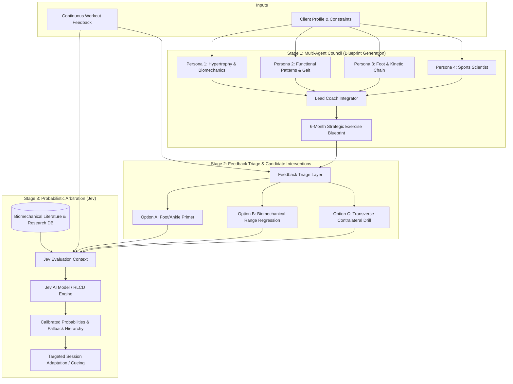
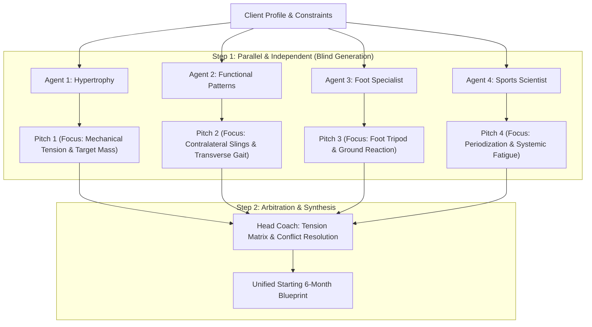
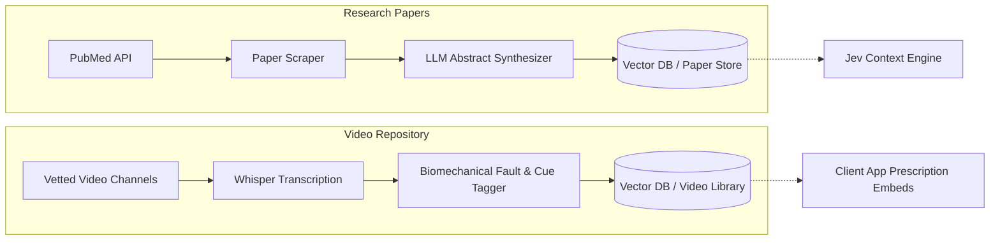
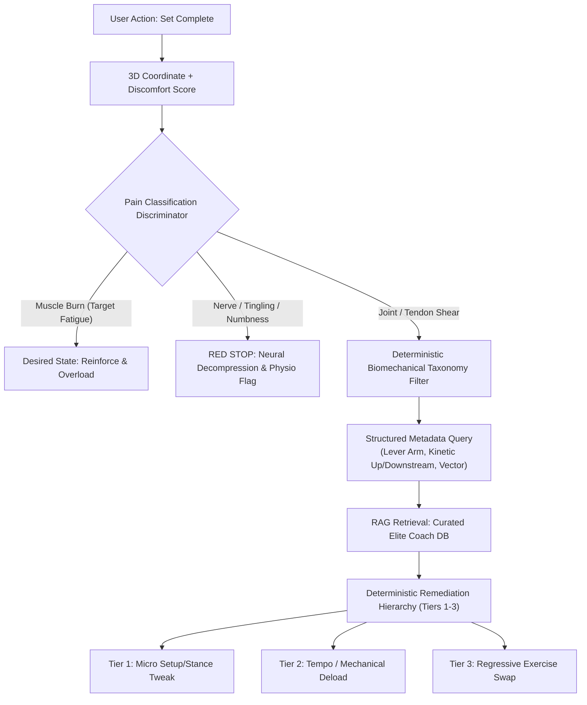

# AI Exercise Blueprint System: Architecture & MVP Specification

> **Status:** Draft for Review & Comments  
> **Target Audience:** Product Lead, System Architects, Junior/Mid-level Engineers  
> **Artifact Version:** 1.0.0

---

## 1. Executive Summary & Vision

The ultimate goal of this system is to produce an **evolving, perfect exercise plan** that adapts dynamically over time as the client trains, recovers, and progresses. 

However, **the critical first step is to establish the "Starting Exercise Blueprint."** 

Think of the Blueprint as the master rulebook: it defines which body parts to focus on, how to split effort across different goals (such as muscle growth, joint stability, or elasticity), how progress will be measured, and how exercises will be chosen. Without this foundational blueprint, an evolving plan quickly turns into an unorganized, reactive list of random workouts. Once this starting blueprint is locked in, specific daily exercises are selected and continuously refined through feedback.

Rather than relying on a single monolithic LLM prompt that suffers from "regression to the mean" (cookie-cutter fitness advice) or superficial trade-offs, this system leverages a **Multi-Agent Specialist Council** that debates biomechanics, a **Decisive Head Coach Arbiter** that enforces real-world constraints, and **Jev (TypeSafe AI)** to probabilistically evaluate candidate interventions against scientific research and user feedback.



---

## 2. The Starting Exercise Blueprint vs. The Evolving Plan

To ensure conceptual clarity across the engineering team:
* **The Starting Exercise Blueprint (Phase 1 Deliverable):** A strategic architecture document. It is **not** a spreadsheet of daily sets and reps, nor does it list every specific exercise for the 6 months. Instead, it establishes the biomechanical rules, subsystem priorities, functional focus weightages, progression dimensions, and exercise selection methodology.
* **The Evolving Exercise Plan (Phase 2 & Beyond):** The living, operational execution. Specific exercises are chosen matching the blueprint's rules, delivered to the client, and progressively adapted via continuous feedback loops and Jev decision scoring.

### Required Components of the Starting Blueprint:
1. **Target Body Parts / Kinetic Subsystems:** Defined not just as isolated muscles (e.g., "biceps"), but functional complexes (e.g., *Foot-Ankle Complex*, *Pelvic-Hip Complex*, *Thoraco-Scapular Complex*).
2. **Functional Focus Allocation (Zero-Sum Budget):** For each subsystem, explicit percentage weightages across:
   - **Hypertrophy & Mechanical Tension**
   - **Motor Control & Joint Centration**
   - **Kinetic Chain Elasticity & Fascial Recoil**
   - **Nervous System & Rate of Force Development (RFD)**
3. **Biomechanical Rationale:** Causal justification explaining *why* the percentages and subsystem focus were chosen based on the client's specific pathology, posture, and goals.
4. **Exercise Selection Methodology:** Strict inclusion/exclusion rules governing what exercises may be introduced (e.g., *"No bilateral axially loaded spinal compression until unilateral pelvic stability is demonstrated"*).
5. **6-Month Multi-Dimensional Progression:** Explicit milestones across planes of motion (sagittal $\rightarrow$ frontal $\rightarrow$ transverse), complexity, and neuromuscular demand.

---

## 3. The Multi-Agent Council

To avoid generic advice, the system simulates 4 distinct personas who research independently, critique each other's proposals, and submit to an arbiter.

| Persona | Core Philosophy | Typical Focus | Primary Blind Spot / Bias |
| :--- | :--- | :--- | :--- |
| **Hypertrophy & Biomechanics** *(e.g., Athlean-X style)* | Maximizing internal mechanical tension, active range of motion, muscle-mind connection. | Joint centration, stimulus-to-fatigue ratio, hypertrophy. | Can over-index on isolated/bilateral patterns; neglects gait dynamics. |
| **Functional & Gait Specialist** *(e.g., Functional Patterns style)* | Reciprocal gait cycle, contralateral fascial slings, rotational mechanics. | Transverse plane, ribcage-pelvic alignment, multi-planar movement. | Can be overly dogmatic against traditional compound lifts (squats/deadlifts). |
| **Foot & Kinetic Chain Specialist** | Ground reaction force, foot tripod, calcaneal eversion/inversion, tibial rotation. | Foot intrinsics, ankle dorsiflexion, plantar fascia loading. | Can over-prescribe isolated micro-drills that consume too much workout time. |
| **Sports Scientist** | Periodization, systemic fatigue management, neuromuscular rate of force development. | Work capacity, recovery kinetics, load-velocity profiling. | Can prioritize abstract performance metrics over aesthetic/client preferences. |
| **Head Coach / Arbiter** | Enforcing real-world constraints, zero-sum budgets, and mechanical hierarchy. | Final synthesis, constraint adherence, dispute settlement. | None (acts strictly as governor and judge). |

### 3.1 Interaction Protocol: Parallel RFP + Tension Matrix Arbitration

To build the starting blueprint, the system explicitly uses a **Parallel Request-for-Proposals (RFP)** model rather than a sequential committee:



#### Step 1: Parallel & Independent Blind Submissions (Zero Contamination)
* All specialist agents receive the client's profile simultaneously.
* Each agent generates their ideal subsystem wishlists, functional focus weightages, and exercise selection methodology **in total isolation**.
* **Benefit:** Eliminates cross-contamination. The Foot Specialist isn't intimidated by the Hypertrophy Coach's heavy lifting ambitions; the Functional Patterns specialist presents their movement paradigm purely without early compromise. Execution is parallel and takes only 2–4 seconds total.

#### Step 2: Tension Matrix Arbitration by the Head Coach
The Head Coach receives all 4 proposals and builds a **Tension Matrix** to resolve competing priorities:
1. **Goal-Weighting:** If the user's primary goal is muscle gain, Hypertrophy receives the largest percentage of the functional budget (e.g., 45%).
2. **Prerequisite Filtering:** If the Foot or Movement specialist identifies an active structural pathology (e.g., collapsed arch, severe pelvic torsion), that insight becomes an **exercise selection filter** rather than a volume tax. 
   - *Example ruling:* *"Hypertrophy remains the #1 goal (45% weight), but Foot/FP constraints prohibit bilateral barbell deadlifts. Hypertrophy will be achieved through split-stance and unilateral cable hinges."*
3. **Budget Normalization:** The Head Coach normalizes all functional focuses so they sum to exactly 100% and fit the client's weekly time constraint.

---

### 3.2 Architectural Decision Record: Why "Sequential / Cascading Buy-In" Was Rejected

We considered having the Lead Coach first align with the dominant agent (e.g., Hypertrophy), then bring in Agent 2 to negotiate, then Agent 3, gradually building group consensus. **This was rejected for three critical reasons:**

1. **Severe Anchoring Bias (The "Late Specialist" Trap):** The client's ultimate goal (e.g., hypertrophy) is downstream of foundational mechanics (e.g., foot/pelvic stability). If the dominant coach drafts the core plan first, foundational specialists brought in later become afterthoughts—relegated to tiny warm-up footnotes rather than fixing the structural leaks that cause injury.
2. **LLM Sycophancy / Groupthink:** LLMs naturally defer to existing consensus in their context window. When a late agent sees that two other agents have already "agreed," it will almost always say *"I agree with my colleagues' great plan"* and offer only trivial tweaks, destroying the value of specialist personas.
3. **Compounding Latency & Costs:** Sequential multi-agent negotiation causes exponential token growth and requires 6–8 serial LLM calls, pushing response times to 60–90+ seconds.

**Conclusion:** Keeping specialist generation **parallel and independent**, followed by **authoritative arbitration**, produces higher clinical quality, eliminates bias, and runs in seconds.

---

## 4. Continuous Feedback & Adaptation Loops

A static blueprint is an open-loop hypothesis. Integrating user session feedback closes the loop.

```
[User Session Feedback] 
        │
        ├──> Pain / Discomfort reported? ──> TRIGGER: Fast Micro-Triage (Branch 3 & 4)
        │
        └──> Routine Completion Log ─────> BATCH: Weekly Progression Monitor
                                                 │
                                                 └──> (Every 6-8 Weeks) ──> Macro Blueprint Audit
```

### 4.1 Feedback Architecture: Micro-Loop vs. Macro Escalation

Not all user feedback is created equal. The system categorizes issues into two distinct tiers:
1. **Transient Niggles:** Temporary muscle soreness, minor fatigue, or a quick form cue fix. These are resolved immediately within the weekly workout without touching the 6-month blueprint.
2. **Foundational Blockers (Long-Term Structural Issues):** Structural limitations that cannot be solved in a single workout (e.g., *a client cannot squat below parallel without their heels rising and lower back rounding due to severe talocrural ankle stiffness*). These **must be escalated** into the Blueprint as a formal **6-Month Corrective Unlock Track**.

```
[User Session Feedback] 
        │
        ├──> Transient Issue (Mild soreness/cue tweak) ────> MICRO-LOOP: Immediate Cue / Temporary Regression
        │
        └──> Foundational Blocker Detected? ───────────────> ESCALATION PROTOCOL:
             (e.g., Severe ankle restriction blocking squat)       │
                                                                  ▼
                                                    [Head Coach & Specialist Council]
                                                                  │
                                                    Adds a "6-Month Corrective Unlock Track" 
                                                    directly into the Blueprint Progression
```

---

### 4.2 Decoupling Micro vs. Macro Updates

* **The Micro-Loop (Weekly / Immediate):**
  - **Allowed actions:** Add a 3-minute warm-up primer, attach a form cue video, temporarily regress a movement angle for the current workout (e.g., elevate heels on squats to keep training quads today).
  - **Constraint:** Does not alter the high-level 6-month functional targets unless the Escalation Protocol is triggered.

* **The Macro-Loop & Escalation Protocol (Foundational Blockers & 6–8 Week Audits):**
  - **When Triggered:** Either during the scheduled 6–8 week audit, OR when recurring feedback reveals a deep structural bottleneck (e.g., persistent lack of ankle dorsiflexion across 2–3 sessions).
  - **Blueprint Integration (Example: "Unlocking the Perfect Squat"):**
    - *The Problem:* The client cannot achieve deep squat mechanics due to rigid calves and collapsed foot arches.
    - *The Blueprint Update:* The Head Coach tasks the **Foot/Kinetic Chain Specialist** with establishing a dedicated 6-month milestone ladder inside the Blueprint:
      - **Phase 1 (Weeks 1–8):** Banded talocrural joint mobilizations, loaded soleus eccentrics, and heel-elevated goblet squats to maintain hypertrophy without joint impingement.
      - **Phase 2 (Weeks 9–16):** Progressive reduction of heel elevation on slant boards, introducing barefoot lateral foot tripod control.
      - **Phase 3 (Weeks 17–24):** Achievement of full-depth, flat-ground barbell back squat with neutral pelvis and upright torso.
  - **Result:** The client continues building muscle today while systematically rebuilding the foundational mobility required for long-term health.

---

## 5. Jev Probabilistic Decision Engine

When a user reports an issue (e.g., joint irritation or poor target muscle recruitment), the specialist agents will propose competing solutions.

Instead of prompting an LLM to guess which is best, we use **Jev (by TypeSafe AI)**. Jev is a System-1 AI model trained via **Reinforcement Learning for Calibrated Decisions (RLCD)** that outputs fast (70–500ms), mathematically calibrated probability distributions over discrete options.

### Expected Value of Intervention (EVI) Decision Logic
Given Jev's output $P(\text{Success})$, the system selects the optimal action using decision theory:

$$\text{Priority Score} = \frac{P(\text{Success}) \times \text{Impact}}{\text{Time/Friction Cost} + \text{Disruption Risk}}$$

* **Primary Recommendation:** Highest Expected Value (often a low-friction primer or setup cue).
* **Fallback Ladder:** If the user reports the issue persists after 2 sessions, the system automatically falls back to the next ranked intervention (e.g., movement regression).

---

## 6. Concrete End-to-End Walkthrough Example

### 6.1 Client Profile
```json
{
  "client_id": "user_4092",
  "age": 34,
  "occupation": "Software Engineer (desk worker 9 hrs/day)",
  "goals": ["Build glute and upper back hypertrophy", "Eliminate chronic right knee ache"],
  "constraints": {
    "days_per_week": 3,
    "session_duration_minutes": 45,
    "equipment": "Full commercial gym"
  },
  "current_status": {
    "experience": "Intermediate lifting (3 years)",
    "noted_issues": "Right foot flat/pronated, anterior pelvic tilt tendency"
  }
}
```

### 6.2 Generated 6-Month Blueprint (Excerpt)
* **Subsystem 1: Pelvic-Hip Complex (Glute & Posterior Chain Focus)**
  - **Functional Weightages:** 45% Hypertrophy & Mechanical Tension, 35% Transverse/Pelvic Stability, 20% Kinetic Chain Elasticity.
  - **Selection Methodology:** Prioritize unilateral and split-stance hinge patterns before loading bilateral axial deadlifts to prevent asymmetric pelvic shear.
* **Subsystem 2: Foot-Ankle Subsystem**
  - **Functional Weightages:** 60% Foot Tripod & Inversion Control, 40% Dynamic Ankle Dorsiflexion.
  - **Selection Methodology:** Embedded as 3-minute superset primers between rest periods of primary lifts to protect the 45-minute total workout constraint.

---

### 6.3 Feedback Event (Week 2, Session 3)
```json
{
  "exercise_performed": "Barbell Romanian Deadlift",
  "weight_and_reps": "80kg x 8 reps x 3 sets",
  "muscle_felt": "Intense lower back pump, slight right hamstrings, zero glute pump",
  "joint_discomfort": {
    "location": "L4-L5 Lumbar spine (Right side)",
    "severity_1_to_5": 3
  },
  "notes": "Felt compressed at bottom of hinge. Right knee felt slightly twisted inward."
}
```

---

### 6.4 Candidate Interventions Proposed by Specialists
1. **Option A (Foot Specialist):** 
   - *Intervention:* Foot Tripod & Calcaneal Inversion Primer (3 min before lift with resistance band).
   - *Hypothesis:* Restoring medial arch height prevents tibial internal rotation and reactivates the glute medius.
2. **Option B (Hypertrophy / Form Specialist):** 
   - *Intervention:* Elevated-Toe Deficit Hinge to Mid-Shin only (Limit Range of Motion).
   - *Hypothesis:* The client is exceeding active hip flexion range and using lumbar flexion to reach the bottom.
3. **Option C (Functional Patterns Specialist):** 
   - *Intervention:* Replace Barbell RDL with Single-Leg Contralateral Cable Pulley Hinge.
   - *Hypothesis:* Bilateral sagittal loading locks the pelvis; single-leg loading forces rotational reciprocal gait stabilization.

---

### 6.5 Grounding Research & Jev Arbitration
* **Input to Jev:** Client feedback + summaries of 3 biomechanics studies on lumbar shear and glute activation.
* **Jev Calibrated Output:**
  ```json
  {
    "calibrated_probabilities": {
      "option_b_rom_limit_hinge": 0.51,
      "option_a_foot_tripod_primer": 0.36,
      "option_c_contralateral_cable": 0.13
    },
    "confidence": 0.84
  }
  ```
* **System Action:**
  - **Immediate Update (Next Session):** Execute **Option B** (limit hinge range to mid-shin) paired with **Option A** as a 2-minute warm-up primer.
  - **Fallback:** If pain $> 1$ occurs next week, automatically shift to **Option C**.

---

## 7. MVP Technical Specification & Developer Branches

To ensure smooth execution by junior or intermediate developers, the codebase is isolated into 5 sequential Git branches.

```
main
 └── feature/01-data-schemas        (Data models & static seed data)
      └── feature/02-agent-council  (Blueprint multi-agent generator)
           └── feature/03-feedback-triage  (Intervention generator)
                └── feature/04-jev-arbiter (Jev probabilistic evaluator)
                     └── feature/05-app-runner (End-to-end executable demo)
```

### Branch Details:

#### 1. `feature/01-data-schemas`
* **Objective:** Define all data models using Pydantic and provide static mock files.
* **Key Files:**
  - `src/models/user.py`: `UserProfile`, `Constraints`
  - `src/models/blueprint.py`: `SubsystemFocus`, `ExerciseBlueprint`
  - `src/models/feedback.py`: `WorkoutFeedback`, `InterventionOption`
  - `seed_data/mock_research.json`: 3 static summaries of peer-reviewed biomechanics studies.
* **Acceptance Criteria:** Unit tests pass validating that sample JSON files parse cleanly into Pydantic models.

#### 2. `feature/02-agent-council`
* **Objective:** Implement the 4 specialist LLM prompts + Head Coach arbiter.
* **Key Files:**
  - `src/agents/prompts/hypertrophy.py`
  - `src/agents/prompts/functional.py`
  - `src/agents/prompts/foot.py`
  - `src/agents/prompts/head_coach.py`
  - `src/services/council_service.py`
* **Rules:** The Head Coach prompt must strictly enforce that functional percentages sum to 100% and session time limits are respected.
* **Acceptance Criteria:** Script outputs a valid `ExerciseBlueprint` JSON from `sample_user.json`.

#### 3. `feature/03-feedback-triage`
* **Objective:** Ingest workout feedback and prompt specialists to propose candidate interventions.
* **Key Files:**
  - `src/services/triage_service.py`: Takes `(blueprint, feedback)` and returns `List[InterventionOption]`.
* **Acceptance Criteria:** A mock pain report produces 3 structured candidate interventions.

#### 4. `feature/04-jev-arbiter`
* **Objective:** Integrate with Jev (TypeSafe AI) to score candidate options against the seed research.
* **Key Files:**
  - `src/services/jev_client.py`: Client for TypeSafe AI / Jev API.
  - `src/services/decision_engine.py`: Combines Jev probabilities with the Expected Value formula.
* **Acceptance Criteria:** Returns ranked interventions with calibrated probability floats.

#### 5. `feature/05-app-runner`
* **Objective:** Glue everything into an interactive CLI demonstration script.
* **Key Files:**
  - `main.py`: End-to-end pipeline run (Load User $\rightarrow$ Generate Blueprint $\rightarrow$ Inject Pain Feedback $\rightarrow$ Triage Options $\rightarrow$ Jev Arbitration $\rightarrow$ Final Adjusted Session).
* **Acceptance Criteria:** Running `python main.py` completes without errors and logs the decision chain clearly.

---

## 8. Future Scalability: External Data Ingestion (Out of MVP Scope)

*(Documented for architectural continuity; not to be implemented in current MVP sprint).*



1. **Research Ingestion Pipeline:**
   - Query PubMed/ArXiv/Semantic Scholar APIs on recurring cron.
   - Run structured extraction: `[Target Joint/Tissue, Mechanism, Quality Score (1-5), Clinical Finding]`.
   - Embed and index for semantic retrieval during Jev arbitration.
2. **Video Catalog Ingestion Pipeline:**
   - Ingest high-authority biomechanics channels.
   - Transcribe audio and extract: `[Exercise Name, Category (Primer/Cue/Regression), Symptom Fixed, Timestamp URL]`.
   - When an intervention wins, automatically embed the exact 30-second timestamped clip into the client's app.

---

## 9. Edge Cases & Reviewer Discussion Items

Please review the following open points and leave inline comments:

1. **Severe Pain Handling (Red Flags):**
   - *Current Design:* If pain severity $\ge 4/5$ is reported, Jev arbitration should be bypassed in favor of an immediate **"Referral to Physical Therapist"** block.
2. **Specialist Dogmatism / Deadlock:**
   - *Current Design:* The Head Coach Arbiter has absolute dictatorial authority. If specialists disagree on safety vs hypertrophy, safety always receives veto power.
3. **User Compliance vs Efficacy:**
   - If Jev picks a foot drill that the user consistently skips (zero compliance), how should the system decay that intervention's priority score over time?

---

## 10. Closed-Loop Remediation Engine: Per-Set Feedback, 3D Pain Mapping & Clinical RAG Guardrails

To build a robust, dynamic closed-loop—where per-set logs and 3D body coordinates query an elite coach knowledge base without hallucinating dangerous or over-compensatory advice—the architecture enforces three mandatory clinical layers:



### 10.1 Layer A: Pre-RAG "Pain Classification" Discriminator
Users routinely conflate hypertrophic fatigue with joint damage on visual diagrams. Directing raw 3D body clicks directly into a RAG/LLM prompt causes hallucinated exercise swaps. The engine enforces a 1-tap discriminator before retrieval:
1. **Target Muscle Fatigue / Hypertrophic Burn (Desired):** Diffuse, warm sensation across the muscle belly (e.g., quadriceps burning during a wall sit or pump in lats during rows).  
   * *Engine Action:* Reinforce execution; log as successful stimulus; **no exercise swap**.
2. **Delayed Tendon / Ligamentous Strain (High Concern):** Localized, sharp, focal ache at tendon-to-bone insertions (e.g., inferior pole of the patella, medial epicondyle / golfer's elbow, distal triceps tendon).  
   * *Engine Action:* Route immediately into the Deterministic Remediation Engine.
3. **Nerve / Radiating Pain (Critical Stop):** Tingling, electric shock, numbness, or shooting sensation along a nerve pathway.  
   * *Engine Action:* Immediate session pause; mandatory spinal/joint decompression; prompt clinical referral.

### 10.2 Layer B: Biomechanical Taxonomy (Preventing Pure Vector Search Collapse)
A naive vector similarity search on "front of left knee pain" retrieves hundreds of disconnected articles (foam rolling, VMO cues, knee sleeves, backwards walking). The coach knowledge base must be indexed by a structured 3-vector biomechanical taxonomy *prior* to similarity search:
* **Vector 1: Joint Position & Lever Arms:** Did discomfort occur at deep joint flexion (lengthened extreme, max shear) or near lockout (shortened position)?
* **Vector 2: Upstream & Downstream Kinetic Chain:** Patellar pain is rarely an isolated knee problem—it is driven by an ankle dorsiflexion deficit (talocrural block / foot pronation) or hip internal rotation deficit. Inner elbow pain is driven by grip mechanics or shoulder rotation deficits.
* **Vector 3: Contributory Vector:** Classifies whether the fix requires a movement swap, a tempo alteration (slow eccentric/pause), or a setup modification (wedge, stance width, grip).

#### Mandatory Chat Intake Protocol: "Phase-of-Movement Triage" (Layer B Fulfillment)
Whenever a user reports joint or tendon discomfort in chat, the AI agent is **hard-coded to ask exactly WHEN in the movement arc the sensation occurs** before prescribing any intervention:
1. **At the Lengthened Extreme / Bottom Stretch?** (e.g. deep hole of squat, chest touch on floor press, dead hang on pull-up)  
   $
ightarrow$ *Indicates: End-range passive tissue shear, excessive passive ROM, or lack of joint capsule clearance.*
2. **At Peak Shortening / Lockout?** (e.g. top of row, full elbow extension on overhead triceps)  
   $
ightarrow$ *Indicates: Active insufficiency, bony impingement, or joint compression.*
3. **During the Turnaround / Dynamic Transition?** (instant of switching from lowering to lifting)  
   $
ightarrow$ *Indicates: Rate-of-Force Development (RFD) shock; lack of eccentric deceleration braking.*
4. **Post-Set / Delayed Throbbing?** (only after releasing the dumbbells or bar)  
   $
ightarrow$ *Indicates: Tendon vascular remodeling lag or reactive tendinopathy.*

### 10.3 Layer C: Deterministic Guardrails Before LLM Generation (Tiered Remediation Hierarchy)
LLMs are notoriously prone to "compensatory over-fixing"—prescribing three new mobility drills instead of simply changing the foot angle by 5 degrees. The remediation pipeline strictly follows a tiered escalation hierarchy:

| Tier | Intervention Level | Engine Action & Example |
| :--- | :--- | :--- |
| **Tier 1: Setup Tweak** | Micro-Adjustment *(Zero equipment change)* | Keep the exercise, alter the mechanics. (e.g., *"Shift torso forward 10° to transfer load from patella to hip"*, *"Increase heel wedge height"*, or *"Switch to thumbless neutral grip"*). |
| **Tier 2: Tempo / Load Shift** | Mechanical Deload *(Kinetic alteration)* | Reduce load by 15–20%, eliminate explosive concentric, or switch to an isometric hold at a pain-free joint angle (30°–45°). |
| **Tier 3: Regressive Exercise Swap** | Pattern Substitution *(Biomotor equivalent)* | Swap to a biomotor equivalent that removes shear force. (e.g., Heel-Elevated RFESS $\rightarrow$ Reverse Lunge with forward torso lean $\rightarrow$ Poliquin Step-Up on books). |
