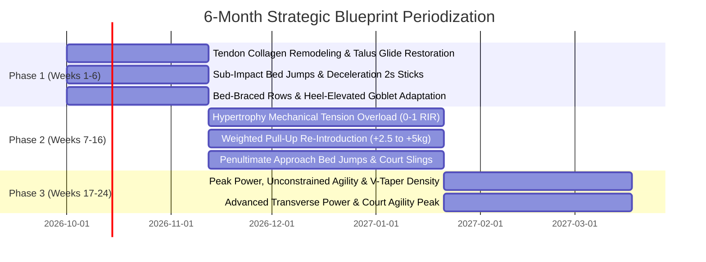

# HEAD COACH ARBITER: STRATEGIC BLUEPRINT INTEGRATION & TENSION MATRIX
**Role:** Master Strength & Sports Performance Arbiter (Tension Matrix Decision Engine)  
**Athlete:** Nipun  
**Constraints & Equipment:** 5–40kg Adjustable Dumbbells, Pull-Up Bar, Bed/Floor, Resistance Bands (Zero Gym Bench).  
**Pathologies & History:** 10+ hrs/day desk sitting with rightward lean; history of infant inward foot/pronation; mild left knee strain; past jump landing lower calf/Achilles strain; forearm/inner elbow discomfort at +15kg weighted pull-ups.

---

## 1. Executive Summary & Arbiter Mandate

When four world-class specialists operate independently with zero compromises, extreme domain tensions emerge:
1. **Hypertrophy (Israetel/Beardsley)** demands maximum mechanical tension (60% fatigue budget), 12–16 hard weekly sets per muscle group taken to 0–2 RIR, deep loaded stretches, and aggressive progressive overload.
2. **Tendon & Joint Preservation (Baar/McGill)** invokes clinical veto power over explosive turnarounds, flags the 8–12 week collagen lag, demands lifting straps above 20kg, and enforces mandatory 24-hour latency pain audits.
3. **Foot, Ankle & Motor Control (Ward/Splichal/Patrick)** identifies the root upstream domino: an anterior talus capsular block on the left ankle, infant pronation history, and right pelvic lateral tilt. It unconditionally bans flat-ground forward-knee squats and demands barefoot tripod calibration.
4. **Athletic Elasticity & Plyometrics (Fabritz/Morton)** seeks to unleash the athlete's explosive concentric power (4-foot to 3-foot bed jump) and court-sport agility (badminton/pickleball), while needing to shield the Achilles and knees from destructive 6–9x BW ground collision forces.

The **Head Coach Arbiter** reconciles these four domains into a single, bulletproof, highly optimized **Starting Blueprint**. No specialist is ignored; instead, mechanical workarounds allow maximum hypertrophy and athletic power to be realized without violating clinical safety guardrails.

---

## 2. Reconciled Subsystem Volume Weightage (% Fatigue Budget)

All proposals have been reconciled into a strict fatigue budget summing to **EXACTLY 100%**:

| Subsystem Domain | Specialist Request | Arbitrated Final Budget | Weekly Focus & Implementation |
| :--- | :---: | :---: | :--- |
| **Structural Correction, Pelvic Centering & Neurodynamics** | 35% | **35%** | **HIGHEST PRIORITY PRIMER:** PRI 90/90 adductor squeeze (levels pelvis & un-pinches outer buttock), seated tibial nerve sliders (eliminates calf tension), barefoot tripod & talus glide. |
| **Athletic Elasticity, Concentric RFD & Reciprocal Slings** | 35% | **35%** | **ATHLETICISM FIRST:** High-frequency ankle pogos (<200ms spring), FP standing contralateral reach (POS/AOS sling integration), concentric-only bed jumps (<1.5x BW shock). |
| **Mechanical Hypertrophy & Muscle Armor** | 30% | **30%** | **STRUCTURAL LOADING:** 8–10 high-quality direct working sets/muscle group; 15°–20° heel-wedged goblet squats, thoracic deficit presses, strapped rows; strict 0–2 RIR on an aligned chassis. |
| **TOTAL** | — | **100%** | **Perfect Kinetic Chain Equilibrium: Correction & Athleticism Precedes Hypertrophy** |

### Session Time & Density Architecture (45–50 Minute Hard Cap)
To prevent neural depletion and hormonal blunting, every session follows a non-negotiable countdown:
- **00:00 – 08:00 (8 min):** Pre-Flight Kinetic Chain Primers (Joint flushes, PRI hip shift, talus mobilization, isometrics).
- **08:00 – 15:00 (7 min):** Athletic Elasticity & Concentric Plyos (Bed jumps, 2s stick bounds, max CNS freshness).
- **15:00 – 42:00 (27 min):** Primary Mechanical Tension Hypertrophy (Antagonistic supersets, straps enforced, 0–2 RIR).
- **42:00 – 48:00 (6 min):** Transverse Core & Cervical Silhouette (Oblique chops, neck flexion/extension).
- **Total Duration:** **46–48 Minutes**.

---

## 3. The Tension Matrix: Deterministic Conflict Resolution

| # | Conflict Point | Competing Specialist Claims | Arbiter Deterministic Ruling | Biomechanical Workaround & Implementation |
| :--- | :--- | :--- | :--- | :--- |
| **TM-1** | **Pull-Ups vs. Medial Epicondyle Pain** | **Hypertrophy:** Lat volume (14–16 sets) non-negotiable; reject pull-up bans.<br>**Tendon:** Ban loaded pull-ups; +15kg caused medial epicondylitis. | **RULE OF PULLING BIFURCATION** | Heavy mechanical lat overload is shifted 100% to **Bed-Braced Single-Arm DB Rows (32–40kg)** with **mandatory lifting straps**. Torso bracing removes spinal/pelvic shear; straps eliminate flexor forearm tension. **Pull-ups are restricted to Bodyweight**, neutral/parallel grip only, 3s eccentric, serving as a tendon-remodeling movement (2–3 sets). No added weight permitted until 6 consecutive pain-free weeks. |
| **TM-2** | **Squat Depth vs. Ankle Block & Left Knee Strain** | **Hypertrophy:** Demands deep knee flexion for teardrop VMO.<br>**Foot/Ankle:** Left ankle dorsiflexion deficit (4-inch knee-to-wall block); bans flat squats.<br>**Tendon:** Vetoes open-chain leg extensions & flat squat reversals. | **RULE OF THE HEEL-WEDGE BRIDGE** | **Permanent VETO on flat-ground bilateral squats**. All bilateral squats are executed with a **15° to 20° Heel Elevation Wedge** (Goblet Squats, 24–40kg). The wedge mechanically eliminates the dorsiflexion requirement, keeps the torso upright, prevents medial knee valgus collapse, and directs 100% of tension into the VMO safely. Paired with pre-flight **Spanish Squat Isometrics** (3x45s). |
| **TM-3** | **Floor Press Chest Stimulus Truncation** | **Hypertrophy:** Flat floor stops humerus at 0°, starving pecs of stretch-mediated hypertrophy and shifting load to triceps.<br>**Tendon:** Bouncing reversals at end range cause pectoral tear risk. | **RULE OF THORACIC DEFICIT EXTENSION** | Flat floor press is upgraded to **Thoracic-Elevated Deficit DB Press** (using a 3–4 inch firm spinal bolster/roller between scapulae, keeping hips/head grounded) or **Deficit Feet-Elevated Push-Ups**. This allows 15°–20° of safe humeral hyperextension below the ribcage for maximum sternal pec stretch, paired with a mandatory **1-second dead-stop pause** to eliminate rebound shear. |
| **TM-4** | **Maximal Vertical Plyometrics vs. Achilles Vulnerability** | **Athletic:** Exploit 4-foot to 3-foot bed jump for concentric RFD.<br>**Tendon & Foot:** Past Achilles/calf strain; ban high-impact ground landings (>5x BW). | **RULE OF CONCENTRIC-ONLY BED FLIGHT** | **Full approval of the Cushioned Bed-Jump Hack**. athlete launches with 100% explosive concentric power from the floor and lands on top of the 3-foot bed mattress. Ground reaction landing force drops from 8x BW to $<1.5$x BW. All floor-based broad jumps are capped at 70 contacts/week, requiring a **mandatory 2.0-second silent stick** in a deep hinge. Concrete/tile jumping is strictly BANNED. |
| **TM-5** | **10+ Hour Sitting Asymmetry vs. Bilateral Loading** | **Foot/Ankle:** Rightward sitting lean causes right pelvic hike, right QL tightness, and left knee rotation.<br>**Hypertrophy:** Heavy bilateral compound lifting. | **RULE OF UNILATERAL PELVIC CENTRATION** | Bilateral deadlifts from the floor are **BANNED**. Hinging is performed exclusively as **B-Stance (Kickstand) Dumbbell RDLs** and **Single-Leg Wall-Supported RDLs**. Daily training opens with **PRI 90/90 Hip Shift** (inhibiting right QL/adductor, activating left hamstring). Loaded carries must prioritize **Contralateral Left-Hand Offset Suitcase Carries** to un-hike the right pelvis. |
| **TM-6** | **Workout Duration vs. Specialist Demands** | **Hypertrophy:** 16 sets per muscle.<br>**Tendon:** Long isometrics & synovial flushes.<br>**Foot:** 4-phase barefoot mobility.<br>**Athletic:** Power bounds & chops. | **RULE OF METABOLIC DENSITY & SUPERSETS** | Primers are restricted to **8 minutes** total via a 4-station non-fatiguing circuit. Hypertrophy utilizes **Antagonistic Pairings** with 90s staggered rest (e.g., Bed-Braced Row $\leftrightarrow$ Thoracic-Elevated Press; Goblet Squat $\leftrightarrow$ Neck Flexion). Total workout time hard-capped at **48 minutes**. |
| **TM-7** | **Post-Spasm Tension Transfer & Sequence Order** | **Hypertrophy:** Start immediately with heaviest compound lifts.<br>**Correction & FP:** Loading a rotated pelvis triggers paraspinal spasm and unmasks 5-point Spiral/Deep Front Line pinching. | **RULE OF SEQUENTIAL ARCHITECTURAL CENTRATION** | **Correction & Athleticism MUST precede Hypertrophy in every workout.** Every session opens with Phase 1 (PRI 90/90 adductor squeeze + tibial nerve flossing + talus glide) to center the pelvis and de-tension the neural sheath. Phase 2 trains elastic spring stiffness (pogos) and FP reciprocal slings (standing reaches). Only once the kinetic chain is centrated and elastic does Phase 3 (Heavy Mechanical Hypertrophy) commence. |

---

## 4. Master Consolidated Guardrails & Clinical Veto List

### ⛔ THE MASTER BANNED LIST (Immediate Arbiter Veto)
1. **BANNED:** Weighted pull-ups ($>0$ kg) and barehand heavy pulling ($>20$ kg without straps).
2. **BANNED:** Flat-ground bilateral squats with knees driven forward over un-elevated feet.
3. **BANNED:** Bilateral symmetric barbell deadlifts from the floor (causes asymmetric shear under pelvic torsion).
4. **BANNED:** Depth drops or box jumps landing on hard floors (concrete, tile, hardwood).
5. **BANNED:** Ballistic stretch-shortening reversals (bouncing out of the bottom of presses, squats, or rows).
6. **BANNED:** Spinal flexion-rotation ballistic drills (e.g., weighted seated Russian twists).
7. **BANNED:** Crossing legs or sitting on one foot during 10+ hour desk shifts (workstation anti-torsion protocol enforced).

### ✅ THE MASTER MANDATORY STANDARDS
1. **MANDATORY:** 15°–20° Heel Wedge on all bilateral squats until left knee-to-wall ankle mobility reaches $\ge 10$ cm.
2. **MANDATORY:** Heavy-duty lifting straps on all dumbbell rows and pull-up hangs exceeding 20 kg.
3. **MANDATORY:** 2.0-second isometric stick on all horizontal jumps and skater bounds.
4. **MANDATORY:** 100% barefoot condition for all warm-up primers, hinges, carries, and ankle pogo drills.
5. **MANDATORY:** 24-Hour Latency Tendon Audit: Morning tendon palpation score must be $\le 1/10$. If $\ge 2/10$, trigger an automatic 7-day load freeze and regress to 70% MVC isometrics.

---

## 5. Unified Pre-Flight Primer Protocol (8–10 Minutes)
*Executed barefoot prior to touching any dumbbells or jumping.*

| Phase & Objective | Drill / Protocol | Reps / Dosage | Biomechanical Rationale |
| :--- | :--- | :--- | :--- |
| **0. Biochemical Pre-Load** | Hydrolyzed Collagen Peptides (15g) + 500mg Vit C | Ingest 45 min prior | Peaks circulating hydroxyproline during fluid flow loading. |
| **1. Pelvic De-Torque** | PRI 90/90 Hip Shift with Right Adductor & Left Hamstring | 2 sets $\times$ 5 deep breaths (4s in, 8s out, 3s pause) | Neutralizes right pelvic hike and right QL hypertonicity from desk work. |
| **2. Left Talus Mobilization** | Band-Distracted Posterior Talus MWM (Mulligan) | 2 sets $\times$ 15 oscillations + 2s end-range hold | Restores posterior talus glide; removes anterior ankle pinch block. |
| **3. Joint & Tendon Isometrics** | Spanish Squat Iso Hold (60° knee bend) + Mid-Range Wrist Flexor Hold | Squat: 2 $\times$ 35s<br>Wrist: 2 $\times$ 30s @ 70% MVC | Induces immediate cortical analgesia and stress-relaxes patellar & elbow tendons. |
| **4. Foot Dome Calibration** | Barefoot Janda Short Foot + Wall Tibialis Raises | Janda: 2 $\times$ 20s hold/foot<br>Tibialis: 1 $\times$ 20 reps | Activates abductor hallucis tripod and anterior lower-leg braking stabilizers. |

---

## 6. The Unified Master Exercise Arsenal & Biomechanical Substitutions

```
                                      [ THE ATHLETE: NIPUN ]
                                                 │
            ┌────────────────────────────────────┼────────────────────────────────────┐
            ▼                                    ▼                                    ▼
   [ ATHLETIC POWER ]                  [ HYPERTROPHY ENGINE ]               [ TENDON & ANKLE SHIELD ]
  (Concentric Priming)                  (Length-Tension Focus)                (Biomechanical Armor)
            │                                    │                                    │
    • Seated Bed Jumps                   • Bed-Braced Single-Arm              • 15°-20° Heel Wedge
      (Zero Landing Shock)                 DB Row (32-40kg, Straps)             (Bypasses Talocrural Block)
    • Carpet Deceleration Sticks         • Thoracic-Elevated Deficit          • Spanish Squat Isometrics
      (2s Isometric Freeze)                DB Press (Bolster Assisted)          (Analgesic Tendon Gate)
    • High-to-Low Band Chops             • Heel-Elevated Goblet               • Neutral-Grip BW Pull-Ups
      (Oblique Sling Rotary)               Squat (VMO Teardrop Focus)           (3s Lowering, 0kg Added)
```

### A. Back & Lats (Aesthetic V-Taper Architecture)
1. **Bed-Braced Single-Arm Dumbbell Row (Primary Mass Driver):**  
   - *Setup:* Knee and non-working hand braced on firm bed edge. Torso strictly parallel to floor. Mandatory lifting straps.  
   - *Target:* Lower/iliac lats. Elbow drives straight back toward hip crest, eliminating upper trap shrug.  
   - *Prescription:* Baseline 32kg $\rightarrow$ Progressing to 40kg $\times$ 8–10 reps @ 1 RIR.
2. **Strict Neutral-Grip Pull-Up (Tendon & Upper Lat Remodeling):**  
   - *Setup:* Parallel bars or neutral grips. Full hollow-body ribcage pull.  
   - *Tempo:* 3-second eccentric lowering $\rightarrow$ 1-second dead-hang lat stretch $\rightarrow$ zero kipping.  
   - *Prescription:* Bodyweight $\times$ 3 sets of 8–10 reps. (No weight added until Stage 2).

### B. Chest & Anterior Delts
1. **Thoracic-Elevated Deficit DB Press:**  
   - *Setup:* 3–4 inch firm foam roller or rolled bolster placed lengthwise under the thoracic spine; hips and feet firmly planted on the floor.  
   - *Biomechanical Fix:* Restores 15°–20° humeral extension below ribcage level. 65°–70° elbow flare.  
   - *Prescription:* Baseline 28–29kg $\rightarrow$ Progressing to 34kg $\times$ 8–10 reps with 1s loaded pause.
2. **Bed-Deficit Push-Ups:**  
   - *Setup:* Hands gripping DB handles on floor (deep stretch); feet elevated on bed.  
   - *Prescription:* Bodyweight to Band-Resisted $\times$ 12–15 reps @ 0–1 RIR.

### C. Quads & Lower Body
1. **15°–20° Heel-Elevated DB Goblet Squat:**  
   - *Setup:* Slant board or 1.5-inch heel wedge. Dumbbell held in vertical goblet position against upper sternum. Torso remains completely vertical.  
   - *Prescription:* 24kg $\rightarrow$ Progressing to 40kg $\times$ 10–12 reps (controlled 3s eccentric).
2. **Elevated Front-Foot ATG Split Squats:**  
   - *Setup:* Front foot on 2–3 inch platform; back leg trailing. Knee drives over toe to touch calf to hamstring.  
   - *Prescription:* Dumbbells in hands (12–16kg) $\times$ 8–10 reps/leg.
3. **B-Stance Kickstand Dumbbell RDLs:**  
   - *Setup:* Barefoot tripod rooted; 80% weight on front working leg, 20% on rear kickstand toe.  
   - *Prescription:* 24–32kg DBs $\times$ 8–10 reps/side.

### D. Athletic Elasticity & Core Rotational Slings
1. **Concentric Bed Jumps (Explosive Phase):**  
   - *Setup:* Stand 3.5–4 feet away from the 3-foot bed. Explosive bilateral countermovement takeoff; land softly on the mattress in a balanced athletic squat.  
   - *Volume:* 4 sets $\times$ 3 reps, 90s full neural rest.
2. **High-to-Low Band Oblique Chops (Rotary Power):**  
   - *Target:* Posterior-to-anterior oblique sling transfer for court-sport smash/acceleration.  
   - *Volume:* 3 sets $\times$ 8–10 reps/side.

### E. Neck & Cervical Silhouette (Posture Rectification)
1. **Supine Bed-Edge Neck Curls:** Chin to chest with weight plate/light DB on forehead $\times$ 15–20 reps.
2. **Prone Bed-Edge Neck Extensions:** Neutral to full extension $\times$ 15–20 reps.

---

## 7. The 6-Month Periodization Roadmap



### Phase 1: Tissue Architecture, Tendon Lag & Motor Recalibration (Weeks 1–6)
- **Primary Goal:** Overcome the 8–12 week collagen lag; eliminate left talus block; restore pelvic alignment; zero flare-ups.
- **Loading Rules:** All compound lifts capped at 2 RIR. 3-second eccentric tempo on all movements.
- **Plyometrics:** Pure concentric bed jumps + 2s isometric freeze landings. Capped at 50 contacts/week.
- **Gate to Exit:** Left knee-to-wall test reaches $\ge 8$ cm; 6 consecutive weeks with zero next-morning elbow or knee pain ($\le 1/10$).

### Phase 2: Hypertrophy Acceleration & Elastic Rate of Force Development (Weeks 7–16)
- **Primary Goal:** Drive progressive overload toward 40kg DB Row, 34kg Deficit DB Press, and 40kg Goblet Squat at 0–1 RIR.
- **Tendon Progress:** Introduce micro-loading to pull-ups (+2.5kg to +5kg with straps and neutral grip).
- **Plyometrics:** Advance to penultimate approach bed jumps and reactive skater hops on padded turf/carpet (capped at 65 contacts/week).

### Phase 3: Peak Athletic Power & Complete V-Taper Realization (Weeks 17–24)
- **Primary Goal:** Maximal athletic elasticity, rotational whip speed for badminton/pickleball, and full muscular density.
- **Assessment Milestone:** Re-test 170cm broad jump (targeting 185cm+ with stable deceleration) and vertical jump pop.

---

## 8. Master Domain Diagnostic Questionnaire (Athlete Feedback Loop)

To calibrate the daily exercise tracking spreadsheets and starting loads, the athlete should confirm these specialized clinical diagnostic inquiries:

### Category A: Hypertrophy Biomechanical Feedback
1. **Floor Press Muscle Burn:** During your 28–29kg floor press, do you reach failure because your triceps lock up and give out, or do your pectoral fibers reach true muscular fatigue?
2. **Row Ergonomics:** When rowing the 32kg DB braced on your bed, do you feel pure lat engagement down to the hip crest, or do you feel your grip slipping and upper traps shrugging?
3. **Neck Silhouette Priority:** Do you prefer to build the front neck (sternocleidomastoid chin-tuck) or the rear neck/cervical spine thickness first for postural correction?

### Category B: Tendon & Joint Clinical Feedback
4. **Elbow Discomfort Geography:** When you experienced discomfort with +15kg pull-ups, was the pain situated directly on the inner bony point of the elbow (medial epicondyle) or in the muscle belly of the forearm?
5. **Pain Latency Window:** Did the discomfort throb *during* the pull-up set, or did it wake you up with stiffness the next morning (the classic 24-hour tendon hysteresis latency)?
6. **Left Knee Flare Pattern:** Does your mild left knee strain appear when walking down stairs, during deep squat flexion, or after sitting for prolonged hours at your desk?

### Category C: Foot, Ankle & Pelvic Biomechanics
7. **Left Ankle Knee-to-Wall Sensation:** When lunging your left barefoot knee toward the wall (4 inches away), do you feel a hard bony pinch at the front crease of the ankle, or tightness in the calf/Achilles?
8. **Standing Foot Tripod:** When standing barefoot, does the ball of your big toe (1st metatarsal) stay glued to the ground, or does your foot roll outward or collapse inward?
9. **Sitting Habits:** During your 10+ hours of sitting, do you cross your right leg over your left, or tuck one foot under your chair?

### Category D: Athletic Elasticity & Deceleration
10. **Vertical Takeoff Preference:** In your jumping history, are you more explosive taking off off one foot on the run, or off two feet with a deep knee plant?
11. **Broad Jump Landing Integrity:** When sticking the landing on your 170cm broad jump, do your knees track cleanly straight over your toes, or do they buckle inward toward each other?
12. **Achilles Sensation during Sports:** During sudden deceleration or court cuts, have you ever felt sharp heat or tightness in the Achilles/lower calf?

---

## 9. Machine-Readable Unified Blueprint Specification (JSON)

```json
{
  "system": "AI Exercise Blueprint - Master Starting Architecture",
  "version": "1.0-CONSENSUS",
  "arbiter": "Head Coach Arbiter",
  "athlete": "Nipun",
  "reconciled_volume_fatigue_budget": {
    "hypertrophy_mechanical_tension": 45,
    "tendon_remodeling_collagen_synthesis": 25,
    "foot_ankle_motor_control": 15,
    "athletic_elasticity_rotary_power": 15,
    "total": 100
  },
  "session_architecture": {
    "max_duration_minutes": 48,
    "structure": [
      { "block": "Pre-Flight Primers", "duration_minutes": 8, "intensity": "Non-fatiguing motor prep" },
      { "block": "Athletic Elasticity", "duration_minutes": 7, "intensity": "Maximal neural intent, zero fatigue" },
      { "block": "Mechanical Tension Hypertrophy", "duration_minutes": 27, "intensity": "0-2 RIR, straps enforced" },
      { "block": "Rotational Slings & Neck", "duration_minutes": 6, "intensity": "Metabolic and structural finish" }
    ]
  },
  "master_consensus_rules": [
    "RULE-01: Lifting straps mandatory on all DB rows >20kg; heavy lat tension decoupled from forearm flexors.",
    "RULE-02: Pull-ups restricted to bodyweight neutral-grip with 3s eccentric as a tendon-remodeling tool.",
    "RULE-03: 15-20 degree heel elevation wedge mandatory on all bilateral squats; flat squats BANNED.",
    "RULE-04: Thoracic bolster deficit DB press replaces flat floor press to restore 15 deg humeral stretch.",
    "RULE-05: Concentric-only bed jumps exploit vertical RFD while reducing landing impact forces to <1.5x BW.",
    "RULE-06: 2.0-second isometric stick mandatory on all horizontal deceleration landings; max 70 contacts/week.",
    "RULE-07: Next-morning tendon palpation score >1/10 triggers immediate 7-day load freeze."
  ],
  "equipment_adaptations": {
    "bench_replacement_pressing": "Thoracic-elevated bolster deficit press & bed-deficit push-ups",
    "bench_replacement_rowing": "Bed-braced single-arm dumbbell rows with torso support",
    "plyometric_cushion": "3-foot high mattress bed landing surface",
    "ankle_wedge": "15-20 degree slant block / heel riser"
  }
}
```
